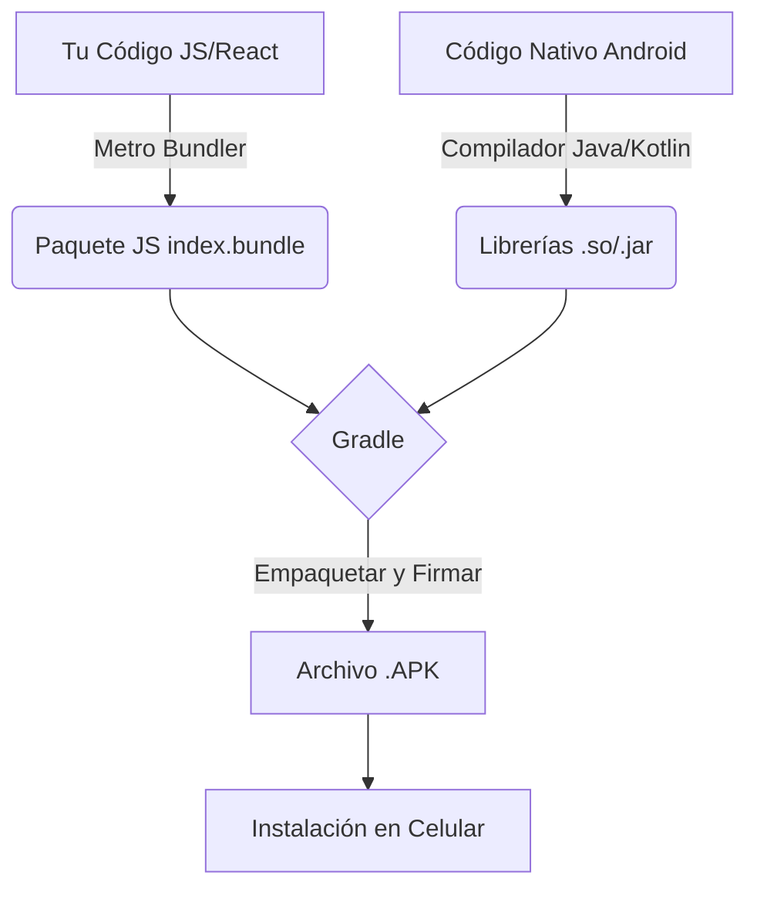

# Proceso de Compilación del APK (Android)

Este documento explica paso a paso cómo se está generando el archivo instalable (`.apk`) para tu aplicación móvil "Hidalguense".

## 1. Entorno de Desarrollo (Tu Mac)
Para que la magia ocurra, tu computadora actúa como una "fábrica de software". Hemos configurado tres herramientas clave:
*   **Java JDK 17**: El lenguaje base de Android.
*   **Android SDK**: Las herramientas oficiales de Google para construir Apps.
*   **Expo / React Native**: La tecnología que usamos para escribir el código (JavaScript) y que luego se "traduce" a una App nativa.

## 2. El Proceso de Construcción ("Build")

Cuando ejecutamos el comando de compilación, ocurren 4 fases principales:

### Fase A: Limpieza (`clean`)
Antes de cocinar, lavamos los platos.
*   El sistema borra las carpetas temporales (`.cxx`, `build`) de compilaciones anteriores.
*   Esto asegura que no haya "código fantasma" o errores viejos que se cuelen en la nueva versión.

### Fase B: Empaquetado de JavaScript (Metro Bundler)
Aquí es donde entra tu código (`App.js`, pantallas, lógica).
1.  **Transpilación**: El sistema toma todo tu código moderno de JavaScript/React.
2.  **Bundling**: Lo comprime en un solo archivo gigante y optimizado llamado `index.android.bundle`.
3.  **Assets**: Copia las imágenes, fuentes e iconos necesarios.

Este "paquete" es el cerebro de tu App.

### Fase C: Compilación Nativa (Gradle)
Ahora Gradle (el albañil de Android) toma el control:
1.  **Librerías Nativas**: Compila el código "duro" que habla con el hardware (Cámara, GPS, Sistema de Archivos, SQLite).
2.  **Fusión**: Mete el "paquete JavaScript" (cerebro) dentro del "cascarón Nativo" (cuerpo).
3.  **Manifiesto**: Configura los permisos (Internet, Almacenamiento, etc.) según el archivo `AndroidManifest.xml`.

### Fase D: Firmado y Ensamblado (`assembleRelease`)
*   Se genera el archivo final `.apk`.
*   Se firma digitalmente (en modo debug/release) para que Android permita instalarlo.

## 3. El Resultado Final

El archivo sale del horno en una ruta profunda y complicada:
`mobile/android/app/build/outputs/apk/release/app-release.apk`

Nosotros copiamos ese archivo automáticamente a tu carpeta de **Documentos** y le ponemos un nombre claro con versión, por ejemplo:
`App-Hidalguense-Universal-V1.10.apk`

---

##  Resumen Visual

